# FilmNoise

Analog grain simulation on grayscale images, inspired by http://www.ipol.im/pub/art/2017/192/

# Why analog grain

Although the dynamic range of analog film cannot be matched, its texure can be mimicked in post-production. However the usual noise distributions don't render film noise (grain) convincingly:  

## Gaussian noise, std=30

  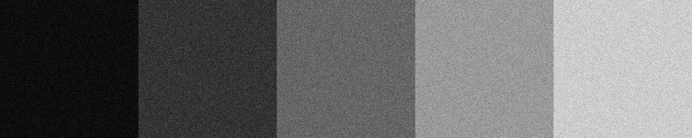

## Bernouilli (0 or 1)
 
 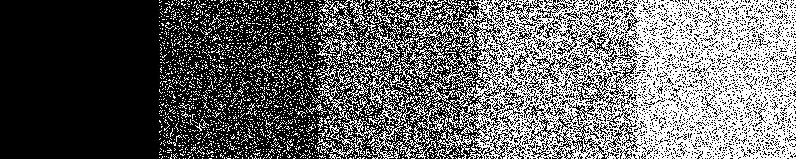

## Ours 

We add white circles to fixed-size black patches, preserving the mean of the pixel of the original image: 
  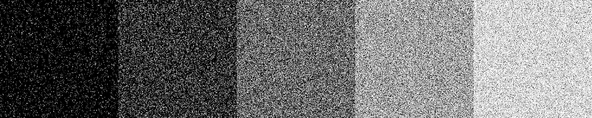

# Examples

  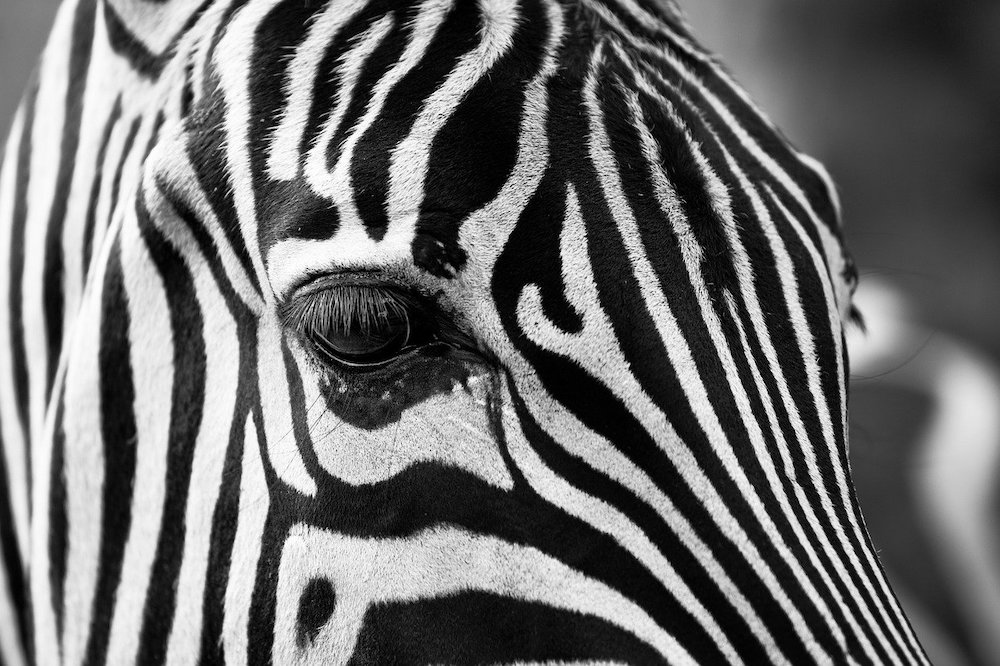
  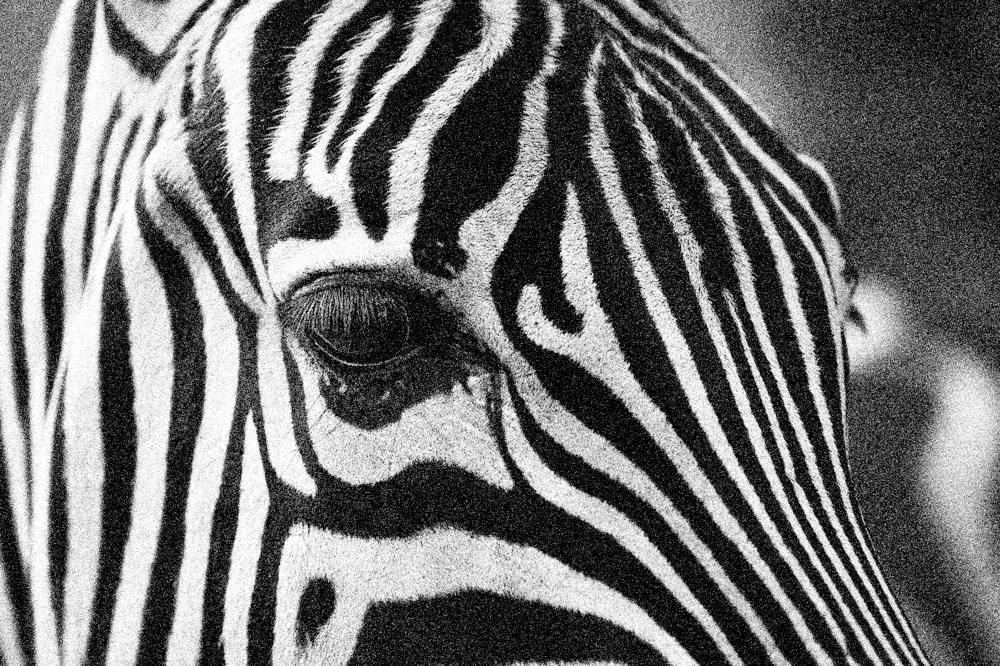

  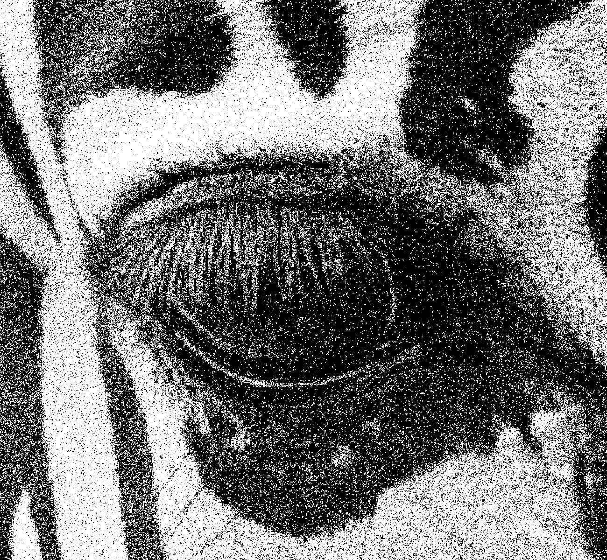

  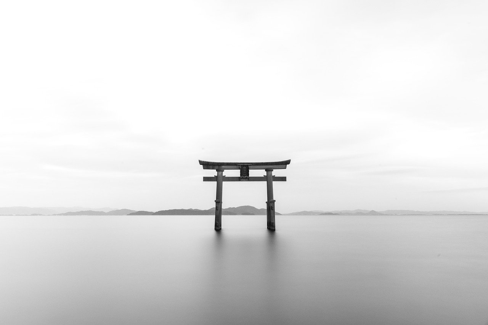
  

  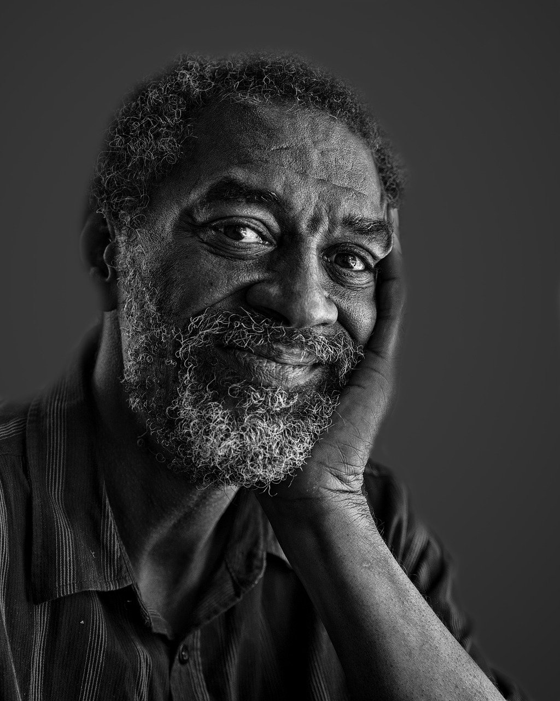
  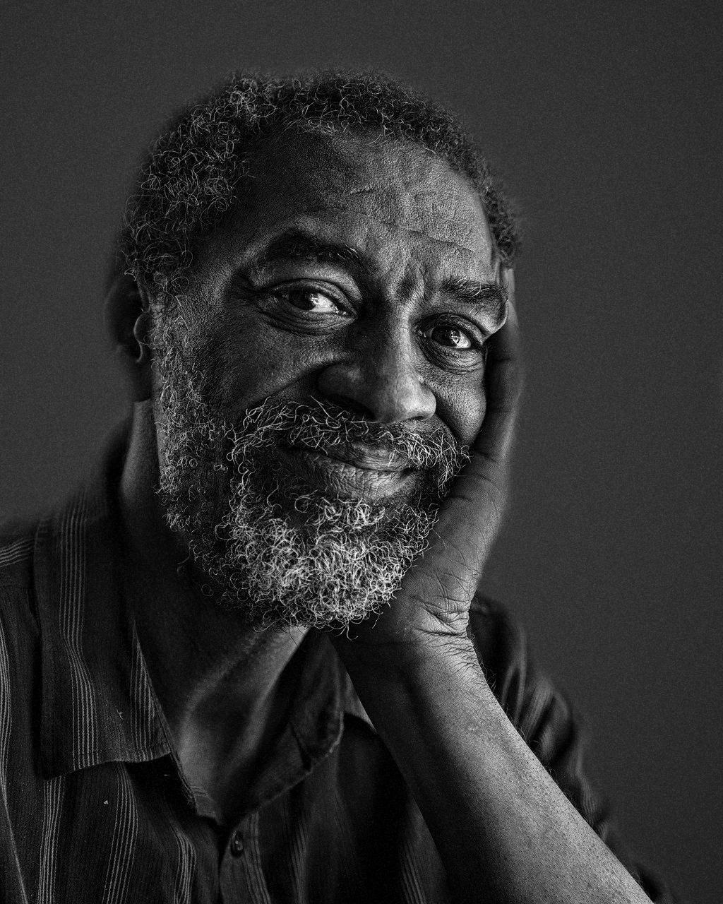

  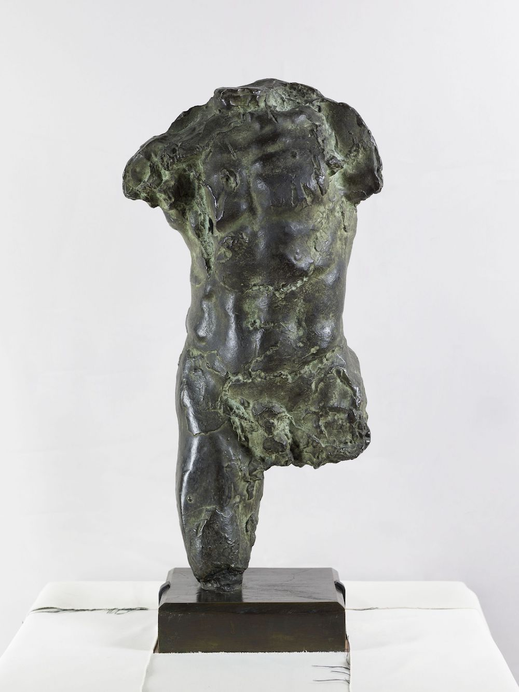
  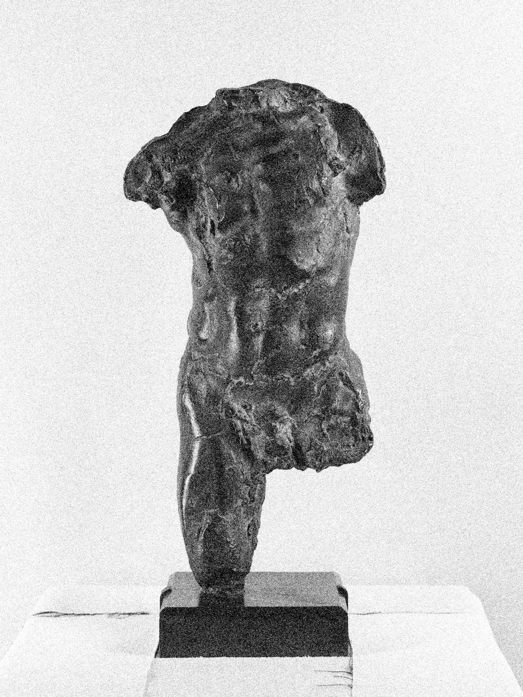

  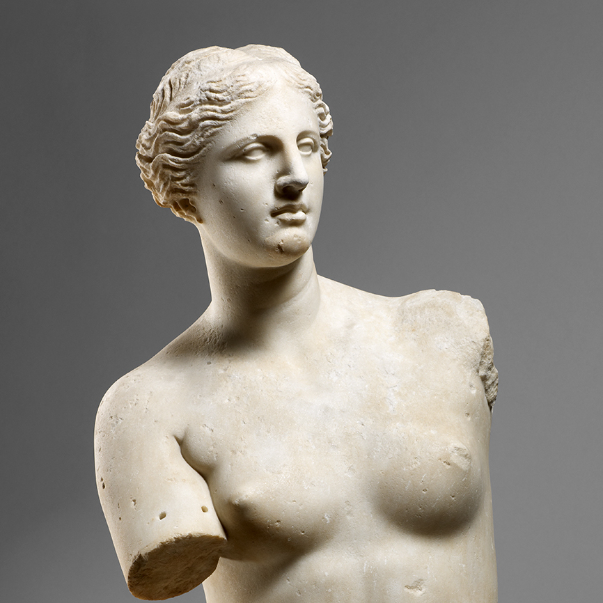
  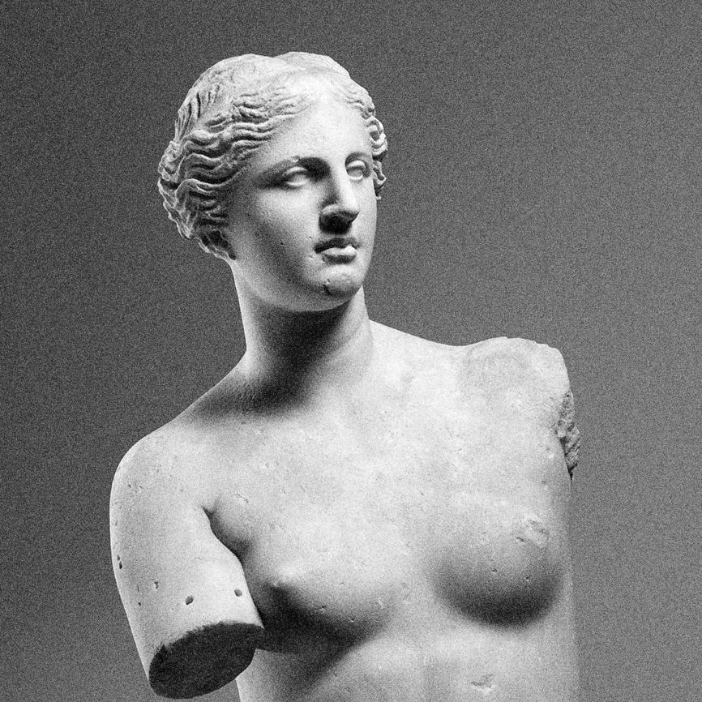

# Code

The code can be ran `noise_image.py`. The mix parameter allows the user to control the intensity of the grain, there is a live preview in the notebook.
The whole process takes about 30s.
